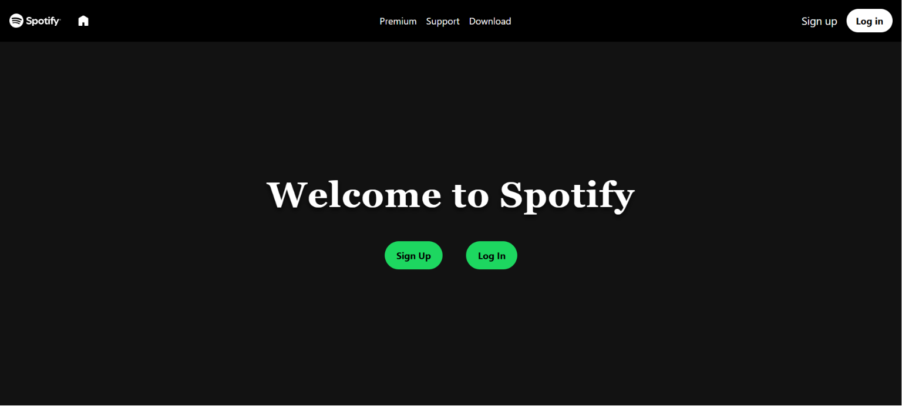
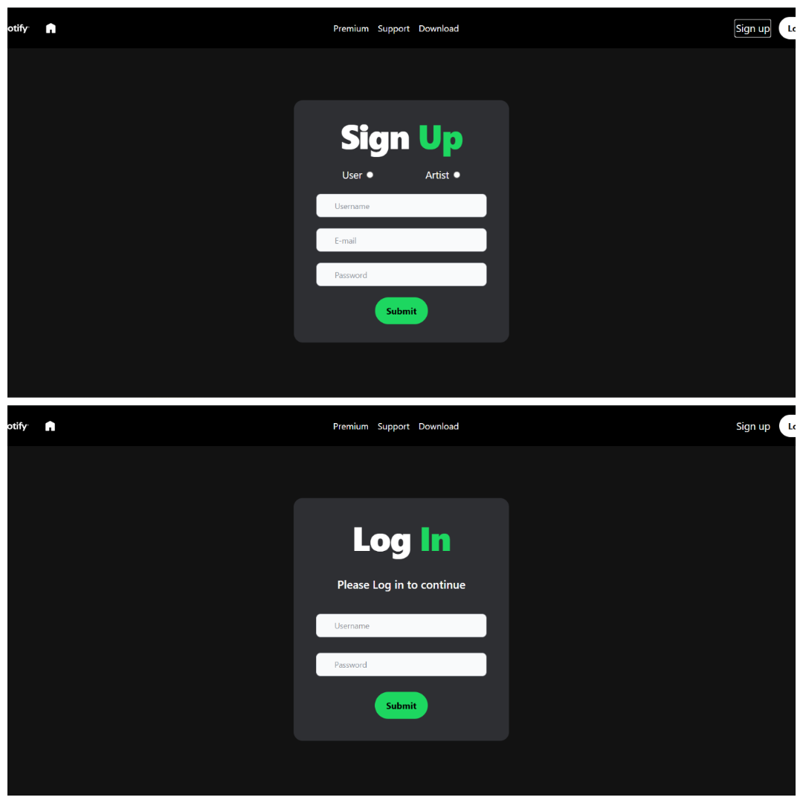
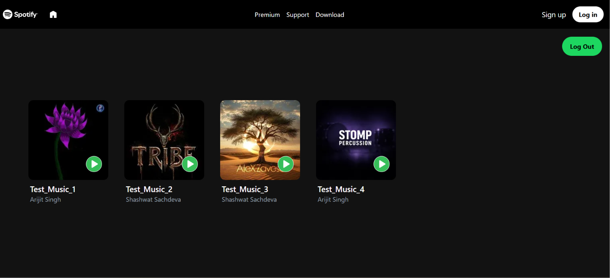
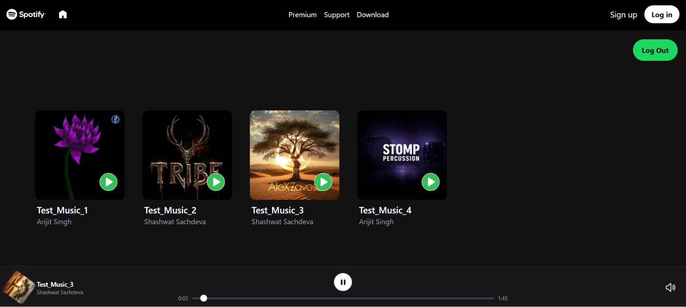
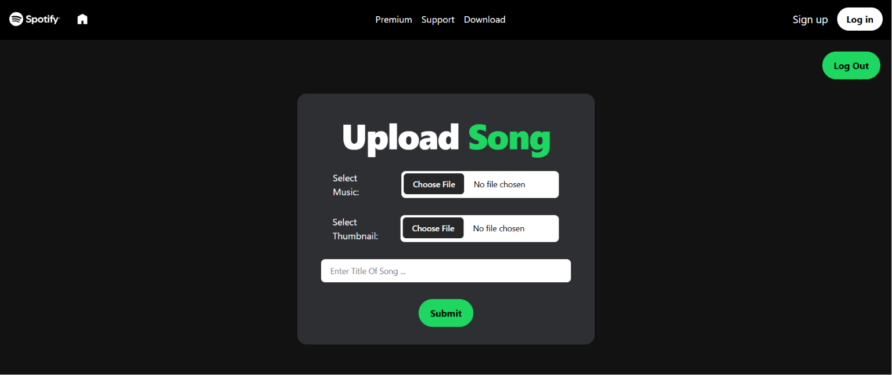

# 🎵 Spotify Clone Project

A production-ready, full-stack music streaming platform featuring role-based access control (RBAC), secure token-based authentication, a decoupled architectural layout, and third-party media CDN integration.

The application implements a strict separation of concerns between standard listeners (**Users**) and content creators (**Artists**), optimized for efficient file parsing and cloud storage synchronization.

---

## 🚀 Key Features

- **Role-Based Architecture (RBAC):**
  - **User:** Can access public streams, navigate personalized feeds, browse multi-tier albums, and trigger real-time audio playback. (Restricted from content management handles).
  - **Artist:** Specialized creator dashboard dedicated strictly to ingestion workflows (track creation, metadata provisioning, canvas/thumbnail uploads). Restricted from public stream interfaces to maintain portal segregation.
- **Robust Security & Session Management:** Stateless `JSON Web Tokens (JWT)` paired with automated cookie parsing (`cookie-parser`) for encrypted context handling and protected routing layers.
- **Enterprise Storage Pipeline:** Integrated with **ImageKit CDN** via custom asynchronous service abstractions to offload thick multi-part binary buffers (audios + high-resolution image thumbnails).
- **Relational Object Mapping:** Clean schemas using **Mongoose ODM** deployed on a distributed cloud topology leveraging **MongoDB Atlas** hosted on **AWS Infrastructure**.

---

## 🛠️ Technologies Used

The application is built using a highly decoupled architecture, leveraging modern web engineering tools to ensure optimal database pooling, secure media streaming, and modular front-end interfaces.

### 🧱 Full-Stack Core Architecture
| Technology | Layer | Deployment Context / Usage |
| :--- | :--- | :--- |
| **React (Vite)** | Frontend | Built as a Single Page Application (SPA) leveraging fast client-side rendering, micro-component architectures, and optimized production builds. |
| **Node.js** | Backend | Runtime environment managing high-throughput asynchronous execution blocks. |
| **Express.js** | Backend | Minimalist backend framework used to design the RESTful routing matrix, role-based access controllers, and centralized middleware pipelines. |
| **MongoDB Atlas** | Database | Cloud-based distributed document database cluster hosted over remote cloud networks. |
| **Mongoose ODM** | Database | Object Data Modeling library used to build strict schema validations, relational data structures, and sanitization rules. |

### ☁️ Infrastructure & Third-Party Integrations
| Service / Tool | Layer | Execution Context / Usage |
| :--- | :--- | :--- |
| **AWS Infrastructure** | Hosting | Utilized a free-tier cloud instance node to launch and run our distributed MongoDB database layer securely. |
| **ImageKit CDN** | Storage | Cloud-native Media CDN used to offload, optimize, and distribute high-fidelity music tracking streams (`.mp3`) and corresponding graphics canvas elements. |

### 📦 Key Backend Libraries
* **`multer` (v2.1.1):** Configured with custom in-memory storage modules to safely handle incoming multi-part `form-data` binary assets without writing heavy caches directly to host server disks.
* **`jsonwebtoken` (v9.0.3):** Handles stateless user sessions by issuing, signing, and decoding secure bearer tokens containing the user's encrypted role configurations (`User` vs. `Artist`).
* **`bcryptjs` (v3.0.3):** Implements strong one-way cryptographic hashing strategies to secure user passwords at rest prior to database insertion.
* **`cookie-parser` (v1.4.7):** Parses digital authorization cookies on incoming requests to extract validation tokens cleanly behind the scenes.
* **`cors` (v2.8.6):** Standard cross-origin security context provisioning middleware designed to regulate strict API network handshakes between our frontend and backend layers.

### 🎨 Key Frontend Tooling
* **Tailwind CSS:** An atomic, utility-first CSS framework used to build completely responsive, theme-driven dashboards with zero overhead styling bundles.
* **Lucide React / SVGs:** Injected lightweight vector-based icon elements ensuring seamless high-resolution responsive rendering across screen scaling changes.

## 📸 Application Layout & Snapshots

The client interface dynamically adapts its layout structure across three distinct session states based on the verified authentication context and role tokens.

### 1. Public Guest Landing Page (Unauthenticated State)

> The entry viewport rendered when a visitor first initializes the application without an active session token. It presents a clean promotional hero canvas alongside navigation hooks directing the guest to authenticate.



### 2. Multi-Page Onboarding Gate (Login / Signup Pages)

> Dedicated, router-mapped viewports (`/login` and `/signup`) built with validation forms. The signup interface captures structural configuration settings, including the specialized account role selection (`User` vs. `Artist`).



### 3. Adaptive Audio Dashboard (Authenticated Listener View)

> Conditionally initialized when the account token carries the standard listener (`User`) flag. Exposes the complete media streaming environment, dynamic content grids, search tracks, and global audio playback controls.



### 4. Active Audio Playback Interface (Live Player View)
> Displays the synchronized real-time state when a user initiates a track stream. Features a persistent media playback bar tracking ongoing track runtimes, interactive pause/play/skip state controllers, and dynamic asset injection mapping the active ImageKit thumbnail and track metadata.



### 5. Isolated Media Ingestion Console (Authenticated Artist View)

> Conditionally rendered when the account token carries the creator (`Artist`) validation flag. Swaps out the media exploration layout entirely, presenting a specialized interface focused on multi-part streaming uploads and track metadata management.



---

## 📂 Project Architecture

The system is split into two cleanly decoupled components following modern micro-repository patterns:

### 1. Backend Service Layer (`/backend`)

Adheres strictly to the industry-standard **MVC (Model-View-Controller) / Service** architectural pattern to decouple data schemas, business orchestrations, and HTTP request lifecycles.

```text
backend/
├── .vscode/
├── node_modules/
├── src/
│   ├── controllers/
│   │   ├── auth.controller.js      # Session handshakes (Registration, Login, Sign-out)
│   │   └── music.controller.js     # Payload distribution, processing & media ingestion
│   ├── db/
│   │   └── db.js                   # Asynchronous Mongoose/MongoDB connection pool
│   ├── middlewares/
│   │   └── auth.middleware.js      # Bearer extraction, token decoding & RBAC enforcement
│   ├── models/
│   │   ├── album.model.js          # Relational structure for multi-track compilation records
│   │   ├── music.model.js          # Track schema tracking CDN references and asset tokens
│   │   └── user.model.js           # Document structure for Identity credentials & authorization flags
│   ├── routes/
│   │   ├── auth.route.js           # Identity verification route mappings
│   │   └── music.route.js          # Media streaming and submission endpoints
│   ├── services/
│   │   └── storage.service.js      # Core ImageKit cloud connection wrapper
│   └── app.js                      # Express configuration pipeline (CORS, Express JSON, Cookie Parser)
├── .env                            # Decoupled deployment variables configuration
├── .gitignore
├── package-lock.json
├── package.json                    # Backend core Manifest file
└── server.js                       # Primary HTTP listener instantiation script
```

### 2. Frontend Interface Layer ('/frontend')

Engineered as a single-page application (SPA) with highly atomic, reusable functional components powered by React and styled via utility-first atomic design primitives with Tailwind CSS.

```text
frontend/
└── src/
    ├── assets/                     # Vector icons (SVGs), splash canvases, and static graphics
    ├── components/
    │   ├── Buttons.jsx             # Highly abstract contextual input controls
    │   ├── DisplaySongs.jsx        # Data grid container rendering queryable tracks
    │   ├── Navbar.jsx              # Responsive header tracking account profiles
    │   └── UploadSongs.jsx         # Binary multi-part form wrapper dedicated to the Artist portal
    ├── pages/
    │   ├── Home.jsx                # Dynamic entry viewport reading RBAC criteria for conditional workflows
    │   ├── Login.jsx               # Access portal capturing identity context
    │   └── SignUp.jsx              # Registration engine provisioning new users/artists
    ├── App.css
    ├── App.jsx                     # Top-level client router and security context dispatcher
    ├── index.css                   # Global directives inject layer for Tailwind CSS configuration
    ├── main.jsx                    # Application bootstrapping target DOM anchor file
    ├── .gitignore
    ├── eslint.config.js
    ├── index.html
    ├── package-lock.json
    ├── package.json                # Frontend ecosystem dependency manifest
    └── vite.config.js              # Build parameters optimizing production asset delivery chunks
```

---

## 📜 Architectural Design Implementation Standard

This project adheres strictly to production-grade architectural patterns, ensuring scalable data processing, high application security, and clean separation of concerns.

### 1. In-Memory Media Streaming Pipeline

- **Zero Disk-Write Overhead:** To prevent storage bottlenecks on the host server, heavy media attachments (MP3 audio streams and high-resolution thumbnails) never touch the local server disk.
- **Stream Aggregation:** The backend uses `multer` configured with standard memory storage buffers. It intercepts incoming multi-part form requests into ephemeral RAM spaces and stream-pipes them asynchronously straight to the **ImageKit CDN** using chunked data uploads.

### 2. Stateless Security & Role-Based Access Control (RBAC)

- **Token-Driven Isolation:** Session data is handled via cryptographically signed `JSON Web Tokens (JWT)` stored securely inside client cookies via `cookie-parser`.
- **Middlewares Verification Gates:** Route execution paths are secured via downstream authorization checks. The system decodes the payload context and blocks cross-role access before any database mutations occur (e.g., standard `User` accounts are strictly barred from targeting content write handles).

### 3. Decoupled Interface Architecture (Conditional Rendering)

- **Atomic Component Design:** The frontend architecture decouples views based on the validated application state.
- **State Interception:** Rather than deploying completely separate applications for consumers and creators, the home layout intercepts the user's role assignment profile upon handshake and dynamically switches out views (`UploadSongs` vs. `DisplaySongs`) on a single canvas workspace.

### 4. Normalized REST & Relational Mapping Interfaces

- **Data Layer Validation:** Schema definitions utilize strict **Mongoose ODM** rules to preserve structural data integrity before pushing updates to the distributed **MongoDB Atlas** cluster hosted on **AWS**.
- **Standardized Server Feedback:** API response blocks feature precise, predictable HTTP status codes pairing identical data signatures for tracking runtime errors or successful updates:

| HTTP Status Code   | Execution Context                                 | Payload Output Structure                             |
| :----------------- | :------------------------------------------------ | :--------------------------------------------------- |
| `200 OK`           | Successful Query / Fetch Sequences                | `{ success: true, data: [...] }`                     |
| `201 Created`      | Successful Resource Ingestion                     | `{ success: true, message: "..." }`                  |
| `401 Unauthorized` | Invalid/Expired Token Handshakes                  | `{ success: false, error: "Access Denied" }`         |
| `403 Forbidden`    | Authenticated Identity Lacks Required Role Rights | `{ success: false, error: "Access Forbidden" }`      |
| `500 Server Error` | Database or External Gateway Timeout              | `{ success: false, error: "Internal Server Error" }` |
